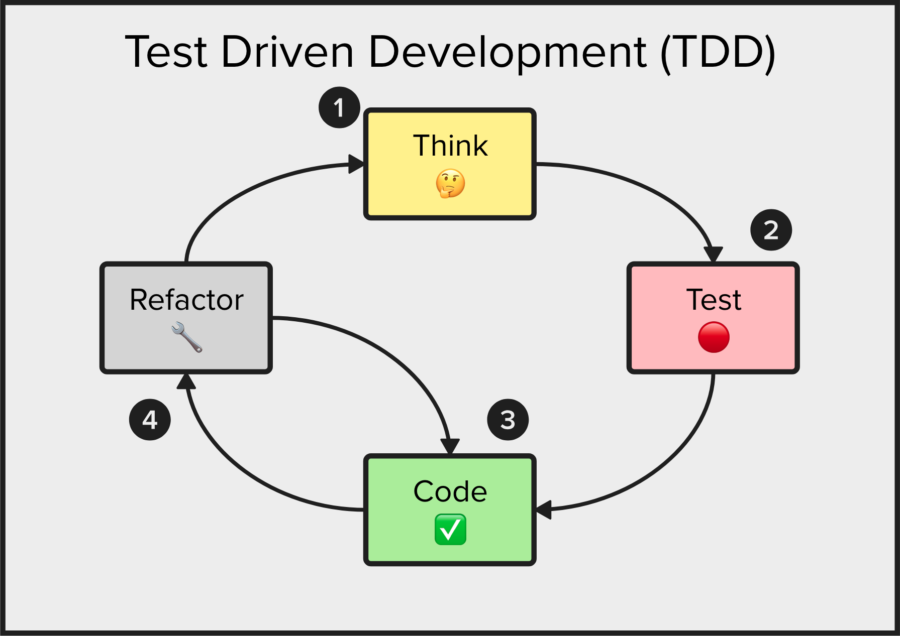

# Chapter 2: Code Kata and TDD

In this chapter we introduce the concept of a _code kata_ and the fundamentals of test-driven development (TDD).

We'll also introduce the concepts of:
* The TDD Cycle
* The Three Rules of TDD
* TDD guided by a truth table
* TDD guided by ZOMBIES

## What is a _code kata_?

_Code kata_ is a term borrowed from martial arts, referring to a practice method in programming where developers engage in repetitive exercises to hone their skills. The idea is to perform these small, self-contained coding challenges repeatedly, each time trying to improve in some way, whether it be in code efficiency, design patterns, speed, or understanding of the language and its features. The term was popularized by Dave Thomas, co-author of "The Pragmatic Programmer," who likened the practice to karate exercises aimed at continuous improvement and mastery of programming techniques.

Code katas are designed to focus on the fundamentals of coding and software design, encouraging developers to explore new strategies, techniques, and technologies in a controlled, practice-based environment. They are not about finding a single correct answer to a problem, but rather about exploring different solutions and approaches, learning from each attempt, and gradually improving one's craft. By regularly practicing Code katas, developers can enhance their problem-solving skills, deepen their understanding of programming paradigms, and become more proficient in their chosen languages and tools.

## What is Test-Driven Development?

Test-Driven Development (TDD) is a software development methodology where tests are written before the actual code. The process follows a short, repeatable development cycle designed to ensure that code meets its requirements and is of high quality. The typical TDD cycle follows three basic steps, often described as red-green-refactor:

1. **Red**: Write a failing test. Before adding or modifying a feature, a developer writes a test that defines a desired improvement or new function. This test will naturally fail since the feature hasn't been implemented yet.

2. **Green**: Write the minimal amount of code required to make the test pass. This step involves writing just enough code to make the test succeed, thus meeting the requirements specified by the test.

3. **Refactor**: Clean up the new code, if necessary. After the test passes, the developer can refactor the code to improve its structure, performance, or readability while ensuring that the test still passes. This step helps maintain code quality and reduce technical debt.

The benefits of TDD include:
- **Improved Code Quality**: TDD leads to code that's more thoroughly tested and less prone to bugs.
- **Better Design**: The need to write tests first encourages better software design and more maintainable code.
- **Documentation**: Tests serve as documentation that explains what the code is supposed to do.
- **Confidence**: Developers can make changes or refactor code with confidence that existing functionality is preserved, as indicated by tests passing.

TDD is part of the Agile development methodologies and encourages a disciplined approach to programming, focusing on requirements and continuous feedback through testing.

### TDD and Thinking

In "The Art of Agile Development", James Shore explains that the first step in the TDD cycle is "Think". You want to be sure that the following steps (Red, Green, Refactor) are based on an understanding of the problem. Not in the larger sense of the word "problem" but in the simplest increment of behavior.

With the perspective of focusing on small increments of behavior during the "Think" step, the Test-Driven Development (TDD) cycle can be described as follows:

1. **Think (small)**: Before writing any code or tests, carefully consider only the next small increment of behavior that needs to be implemented. This step involves understanding the specific piece of functionality or improvement to be added, without getting lost in big upfront designs. The goal is to focus on what's immediately necessary, determining the simplest test that can drive the development of this new behavior.

2. **Red**: Write a failing test that defines the expected outcome of the small increment of behavior identified in the Think step. This test should initially fail because the functionality it describes does not yet exist. Writing this failing test first ensures that any new code written is directly tied to an improvement in functionality and adheres closely to the requirements.

3. **Green**: Implement just enough code to pass the failing test written in the Red step. The emphasis here is on simplicity and effectiveness, aiming to quickly achieve a passing state for the test with minimal code. This encourages writing code that is directly relevant to the feature or fix being developed, without over-engineering or introducing unnecessary complexity.

4. **Refactor**: Once the test passes, examine the code for opportunities to improve its structure, readability, or performance without altering its external behavior. This may involve cleaning up redundancies, applying design patterns where appropriate, or simplifying complex logic. Refactoring with the safety net of tests ensures that improvements do not break existing functionality.

By emphasizing thinking in small increments, the TDD cycle promotes a focused, efficient approach to software development. It encourages developers to maintain a narrow scope, reducing the risk of scope creep or becoming overwhelmed by the broader system's complexities. This iterative process leads to a well-designed, well-tested codebase that evolves incrementally with each cycle, ensuring steady progress and high-quality outcomes.

In [this blog post](https://www.kaizenko.com/what-is-test-driven-development-tdd/), Fadi Stephan illustrates the Test Driven Development cycle.

The TDD cycle is:
1. Think 🤔 -- 
2. Test 🔴 (often called "Red")
3. Code ✅ (often called "Green")
4. Refactor 🔧



## Before We Start Coding

Let's look at the lines in our `TestScaleConverter.cs` file, which you'll find in the `code/ch02` folder in the sample code.

```csharp
using Physics.Temperature;

namespace Tests.Unit.Physics.Temperature;

public class TestScaleConverter
{
    [Test]
    [Ignore("Not yet started")]
    public void Test_FahrenheitToCelsius_When32f_Expect0c()
    {
        // Arrange
        var classUnderTest = new ScaleConverter();

        // Act
        var actual = classUnderTest.FahrenheitToCelsius(32);

        // Assert
        Assert.That(actual, Is.EqualTo(0));
    }
}
```

The `Ignore` attribute tells the NUnit runner to skip the `Test_FahrenheitToCelsius_When32f_Expect0c` test method. The `reason` parameter is optional, but it’s usually helpful to provide a reason.

The `Ignore` attribute is a better mechanism than commenting out the test or renaming methods, since the tests will be compiled with the rest of the code and there is an indication at run time that a test is not being run.

Running this command:
```bash
dotnet test
```

Returns the following output:
```bash
  Determining projects to restore...
  All projects are up-to-date for restore.
  TemperatureConverter -> /Users/ ... /code/ch02/TemperatureConverter/bin/Debug/net8.0/TemperatureConverter.dll
  Tests.TemperatureConverter -> /Users/ ... /code/ch02/Tests.TemperatureConverter/bin/Debug/net8.0/Tests.TemperatureConverter.dll
Test run for /Users/ ... /code/ch02/Tests.TemperatureConverter/bin/Debug/net8.0/Tests.TemperatureConverter.dll (.NETCoreApp,Version=v8.0)
Microsoft (R) Test Execution Command Line Tool Version 17.9.0 (arm64)
Copyright (c) Microsoft Corporation.  All rights reserved.

Starting test execution, please wait...
A total of 1 test files matched the specified pattern.
  Skipped Test_FahrenheitToCelsius_When32f_Expect0c [1 ms]

Skipped! - Failed:     0, Passed:     0, Skipped:     1, Total:     1, Duration: 1 ms - Tests.TemperatureConverter.dll (net8.0)
```

Notice the message ... **Skipped!** ... **Skipped:     1**

The one test was skipped because the `Ignore` attribute is used as a tag to indicate this method should be skipped.

Okay, assuming you have the one skipped test, you are all set to start this code kata.

## Fahrenheit to Celsius Code Kata

Allow me to explain *why* we might want to build a Fahrenheit to Celsius converter.

I have several cousins who live in Ireland. Like much of the world, the local temperature there is reported using the Celsius scale. However, I live in the U.S. and our local temperature is reported using the Fahrenheit scale.

Occasionally, while my cousins and I are messaging, I'd like to convert today's temperature in Fahrenheit to Celsius, so that I can chat with them about the weather.

Let's write this need as a use case:

> As a friendly cousin,
> I want to convert temperature in degrees Fahrenheit to degrees Celsius,
> So that I can chat about the weather with my Irish cousins.

In this chapter, we will use TDD to write a C# program to convert a temperature in degrees Fahrenheit to its equivalent in degrees Celsius.

## Iteration 1

### Step 1: Think (🤔)

Don't just think; _think small_.

*Question:* What is the absolutely smallest behavior you can think of?

For me, the smallest behavior is about the freezing temperature. I know that if it's 32°F outside then I say it's freezing. And I know that that's 0°C.

This is our first entry in a "truth table" that we can use to guide our test driven development.

| Fahrenheit   | Celsius     |
|--------------|-------------|
|       32°F   |       0°C   |

Let's make that first truth our first test.

We want to test a temperature converter function named `FahrenheitToCelsius` and check that it returns 0.

### Step 2: Test (red 🔴)

In this step, you want to have one (and only one) failing test.

We will remove the `Ignore` attribute on the `Test_FahrenheitToCelsius_When32f_Expect0c` method.

Remove that line and save the `TestScaleConverter.cs` file, so it looks like this:

```csharp
using Physics.Temperature;

namespace Tests.Unit.Physics.Temperature;

public class TestScaleConverter
{
    [Test]
    public void Test_FahrenheitToCelsius_When32f_Expect0c()
    {
        // Arrange
        var classUnderTest = new ScaleConverter();

        // Act
        var actual = classUnderTest.FahrenheitToCelsius(32);

        // Assert
        Assert.That(actual, Is.EqualTo(0));
    }
}
```


Running this command:
```bash
dotnet test
```

Returns the following output:
```bash
  Determining projects to restore...
  All projects are up-to-date for restore.
  TemperatureConverter -> /Users/ ... /code/ch02/TemperatureConverter/bin/Debug/net8.0/TemperatureConverter.dll
  Tests.TemperatureConverter -> /Users/ ... /code/ch02/Tests.TemperatureConverter/bin/Debug/net8.0/Tests.TemperatureConverter.dll
Test run for /Users/ ... /code/ch02/Tests.TemperatureConverter/bin/Debug/net8.0/Tests.TemperatureConverter.dll (.NETCoreApp,Version=v8.0)
Microsoft (R) Test Execution Command Line Tool Version 17.9.0 (arm64)
Copyright (c) Microsoft Corporation.  All rights reserved.

Starting test execution, please wait...
A total of 1 test files matched the specified pattern.
  Failed Test_FahrenheitToCelsius_When32f_Expect0c [5 ms]
  Error Message:
   System.NotImplementedException : Not yet started!
  Stack Trace:
     at Physics.Temperature.ScaleConverter.FahrenheitToCelsius(Int32 value) in /Users/ ... /code/ch02/TemperatureConverter/ScaleConverter.cs:line 6
   at Tests.Unit.Physics.Temperature.TestScaleConverter.Test_FahrenheitToCelsius_When32f_Expect0c() in /Users/ ... /code/ch02/Tests.TemperatureConverter/TestScaleConverter.cs:line 14
   at System.RuntimeMethodHandle.InvokeMethod(Object target, Void** arguments, Signature sig, Boolean isConstructor)
   at System.Reflection.MethodBaseInvoker.InvokeWithNoArgs(Object obj, BindingFlags invokeAttr)


Failed!  - Failed:     1, Passed:     0, Skipped:     0, Total:     1, Duration: 5 ms - Tests.TemperatureConverter.dll (net8.0)
```

Notice the message ... **Failed!  - Failed:     1**

Your one test failed because you haven't created the implementation yet. See the *Error Message:* line `System.NotImplementedException : Not yet started!`

But that's a good thing; the test failed because **we expected it to fail**.

#### Quieter Test Runner Output 

Up until this point, the examples run the command `dotnet test` without any parameters. Let's use some parameters to generate quieter test runner output. To learn more about .NET test driver used to execute unit tests, see the article: [dotnet test](https://learn.microsoft.com/en-us/dotnet/core/tools/dotnet-test)

Running this command:
```bash
dotnet test -v q --nologo
```

Returns the following output:
```bash
Test run for /Users/ ... /code/ch02/Tests.TemperatureConverter/bin/Debug/net8.0/Tests.TemperatureConverter.dll (.NETCoreApp,Version=v8.0)
Starting test execution, please wait...
A total of 1 test files matched the specified pattern.

Failed!  - Failed:     1, Passed:     0, Skipped:     0, Total:     1, Duration: 11 ms - Tests.TemperatureConverter.dll (net8.0)
```

This is a bit too quiet. There's very little detail about what failed and why it failed. 

Running this command:
```bash
dotnet test -v m --nologo
```

Returns the following output:
```bash
  Determining projects to restore...
  All projects are up-to-date for restore.
  TemperatureConverter -> /Users/ ... /code/ch02/TemperatureConverter/bin/Debug/net8.0/TemperatureConverter.dll
  Tests.TemperatureConverter -> /Users/ ... /code/ch02/Tests.TemperatureConverter/bin/Debug/net8.0/Tests.TemperatureConverter.dll
Test run for /Users/ ... /code/ch02/Tests.TemperatureConverter/bin/Debug/net8.0/Tests.TemperatureConverter.dll (.NETCoreApp,Version=v8.0)
Starting test execution, please wait...
A total of 1 test files matched the specified pattern.
  Failed Test_FahrenheitToCelsius_When32f_Expect0c [7 ms]
  Error Message:
   System.NotImplementedException : Not yet started!
  Stack Trace:
     at Physics.Temperature.ScaleConverter.FahrenheitToCelsius(Int32 value) in /Users/ ... /code/ch02/TemperatureConverter/ScaleConverter.cs:line 6
   at Tests.Unit.Physics.Temperature.TestScaleConverter.Test_FahrenheitToCelsius_When32f_Expect0c() in /Users/ ... /code/ch02/Tests.TemperatureConverter/TestScaleConverter.cs:line 14
   at System.RuntimeMethodHandle.InvokeMethod(Object target, Void** arguments, Signature sig, Boolean isConstructor)
   at System.Reflection.MethodBaseInvoker.InvokeWithNoArgs(Object obj, BindingFlags invokeAttr)


Failed!  - Failed:     1, Passed:     0, Skipped:     0, Total:     1, Duration: 7 ms - Tests.TemperatureConverter.dll (net8.0)
```

There is a lot of information before `Starting test execution, please wait...` that isn't relevant to the concepts in this chapter.

For the rest of this chapter, let's adopt this `minimum` output option, but the output will be shortened to only provide the lines after the `Starting test execution, please wait...` line.

#### Three Rules of TDD

We need to talk about the *Three Rules of TDD*. These three core rules are:

1. Only write production code to make a failing unit test pass.
2. Only write enough of a unit test to make it fail, including compilation errors.
3. Write only the necessary amount of production code required to pass the failing unit test.

To learn more: [Canon TDD](https://tidyfirst.substack.com/p/canon-tdd)


### Step 3: Code (green ✅)

To follow the three rules of TDD, we should revise the `FahrenheitToCelsius()` method only enough to make the failing unit test pass, as follows:

```csharp
namespace Physics.Temperature;

public class ScaleConverter
{
    public int FahrenheitToCelsius(int value){
        return 0;
    }
}
```

Execute unit tests by running:
```bash
dotnet test -v m --nologo
```

This returns the following output:
```bash
A total of 1 test files matched the specified pattern.

Passed!  - Failed:     0, Passed:     1, Skipped:     0, Total:     1, Duration: 4 ms - Tests.TemperatureConverter.dll (net8.0)
```

### Huzzah!

There's the message in the output ... **Passed!**  ... **Passed:     1**

We have 1 passing test! 🎉


### Step 4: Refactor (tidy 🔧)

In this step, we want to clean up or refactor our code.

However, at this stage, the code is pretty clean.

Let's go on to the next iteration and back to thinking.

## Iteration 2

### I2 - Step 1: Think (🤔)

Again, we have to _think small_.

*Question:* What is the next smallest behavior you can think of?

For me, the next smallest behavior is about the boiling temperature of water. I know from science class that water boils at 212°F and at 100°C.

With that information, we can add it to our "truth table".

| Fahrenheit   | Celsius     |
|--------------|-------------|
|       32°F   |       0°C   |
|      212°F   |     100°C   |

Let's make that second truth our second test.

We want to test our `FahrenheitToCelsius()` method and check that it returns 100°C when we pass it 212°F.

To follow the three rules of TDD, only write enough of a unit test to make it fail.

Let's focus on adding one failing test

### I2 - Step 2: Test (red 🔴)

Let's add this failing test as a method of the `TestScaleConverter` class, in the `TestScaleConverter.cs` file:
```csharp
using Physics.Temperature;

namespace Tests.Unit.Physics.Temperature;

public class TestScaleConverter
{
    [Test]
    public void Test_FahrenheitToCelsius_When32f_Expect0c()
    {
        // Arrange
        var classUnderTest = new ScaleConverter();

        // Act
        var actual = classUnderTest.FahrenheitToCelsius(32);

        // Assert
        Assert.That(actual, Is.EqualTo(0));
    }

    [Test]
    public void Test_FahrenheitToCelsius_When212f_Expect100c()
    {
        // Arrange
        var classUnderTest = new ScaleConverter();

        // Act
        var actual = classUnderTest.FahrenheitToCelsius(212);

        // Assert
        Assert.That(actual, Is.EqualTo(100));
    }
}
```

Save the `TestScaleConverter.cs` file.

Execute unit tests by running:
```bash
dotnet test -v m --nologo
```

This returns the following output:
```bash
A total of 1 test files matched the specified pattern.
  Failed Test_FahrenheitToCelsius_When212f_Expect100c [17 ms]
  Error Message:
     Expected: 100
  But was:  0

  Stack Trace:
     at Tests.Unit.Physics.Temperature.TestScaleConverter.Test_FahrenheitToCelsius_When212f_Expect100c() in /Users/ ... /code/ch02/Tests.TemperatureConverter/TestScaleConverter.cs:line 30

1)    at Tests.Unit.Physics.Temperature.TestScaleConverter.Test_FahrenheitToCelsius_When212f_Expect100c() in /Users/ ... /code/ch02/Tests.TemperatureConverter/TestScaleConverter.cs:line 30


Failed!  - Failed:     1, Passed:     1, Skipped:     0, Total:     2, Duration: 18 ms - Tests.TemperatureConverter.dll (net8.0)
```

We can see
* `Passed:     1`, as expected.
* `Failed:     1`, also as expected.

What failed is:
```bash
  Failed Test_FahrenheitToCelsius_When212f_Expect100c [17 ms]
  Error Message:
     Expected: 100
  But was:  0
```

This is a good thing! This is what was expected.

### I2 - Step 3: Code (green ✅)

To follow the three rules of TDD, we should revise the `FahrenheitToCelsius()` method only enough to make the failing unit test pass.

The simplest thing that could possibly work might be to look for 212 and return 100; otherwise return 0.

In the `ScaleConverter.cs` file, make that change as follows:

```csharp
namespace Physics.Temperature;

public class ScaleConverter
{
    public int FahrenheitToCelsius(int value){
        if(value == 212){
            return 100;
        }
        return 0;
    }
}
```

Save the `ScaleConverter.cs` file.

Now, execute unit tests by running:
```bash
dotnet test -v m --nologo
```

This returns the following output:
```bash
A total of 1 test files matched the specified pattern.

Passed!  - Failed:     0, Passed:     2, Skipped:     0, Total:     2, Duration: 5 ms - Tests.TemperatureConverter.dll (net8.0)
```


### Huzzah!

There's the message in the output ... **Passed!**  ... **Passed:     2**

We have 2 passing tests! 🎉


### I2 - Step 4: Refactor (tidy 🔧)

Again, nothing says we have to refactor. If we're happy with everything as it stands, we can certainly move on to the next iteration and Step 1.


## Iteration 3

Let's start thinking again.

### I3 - Step 1: Think (🤔)

Although we alway want to _think small_, as we perform TDD our understanding grows. Our thinking can grow as our understanding grows.

The key concept with thinking: **keep the incremental changes small**

Based on some common knowledge and a bit of temperature conversion trivia, we may know these facts:
* 0°C = 32°F
* 100°C = 212°F
* -40°C = -40°F

With that information, we can add to to our "truth table".

| Fahrenheit   | Celsius     |
|--------------|-------------|
|       32°F   |       0°C   |
|      212°F   |     100°C   |
|      -40°F   |     -40°C   |

The first two _truths_ are already tested. Let's test the third truth.

### I3 - Step 2: Test (red 🔴)

Let's add this failing test to the bottom of the `TestScaleConverter.cs` file:

```csharp
using Physics.Temperature;

namespace Tests.Unit.Physics.Temperature;

public class TestScaleConverter
{
...

    [Test]
    public void Test_FahrenheitToCelsius_WhenMinus40f_ExpectMinus40c()
    {
        // Arrange
        var classUnderTest = new ScaleConverter();

        // Act
        var actual = classUnderTest.FahrenheitToCelsius(-40);

        // Assert
        Assert.That(actual, Is.EqualTo(-40));
    }
}
```

Save the `TestScaleConverter.cs` file.

Execute unit tests by running:
```bash
dotnet test -v m --nologo
```

This returns the following output:
```bash
A total of 1 test files matched the specified pattern.
  Failed Test_FahrenheitToCelsius_WhenMinus40f_ExpectMinus40c [20 ms]
  Error Message:
     Expected: -40
  But was:  0

  Stack Trace:
     at Tests.Unit.Physics.Temperature.TestScaleConverter.Test_FahrenheitToCelsius_WhenMinus40f_ExpectMinus40c() in /Users/ ... /code/ch02/Tests.TemperatureConverter/TestScaleConverter.cs:line 43

1)    at Tests.Unit.Physics.Temperature.TestScaleConverter.Test_FahrenheitToCelsius_WhenMinus40f_ExpectMinus40c() in /Users/ ... /code/ch02/Tests.TemperatureConverter/TestScaleConverter.cs:line 43


Failed!  - Failed:     1, Passed:     2, Skipped:     0, Total:     3, Duration: 26 ms - Tests.TemperatureConverter.dll (net8.0)
```

As expected, only `Test_FahrenheitToCelsius_WhenMinus40f_ExpectMinus40c` failed.


### I3 - Step 3: Code (green ✅)

To follow the third rule of TDD (*Write only the necessary amount of production code required to pass the failing unit test*), let's write just enough code to make all the tests pass.

This code under test is in the `ScaleConverter.cs` file.

To pass this new test, the code might look like this:

```csharp
namespace Physics.Temperature;

public class ScaleConverter
{
    public int FahrenheitToCelsius(int value){
        if(value == 212){
            return 100;
        }
        if(value == -40){
            return -40;
        }
        return 0;
    }
}
```

Save the `ScaleConverter.cs` file.

Now, execute unit tests by running:
```bash
dotnet test -v m --nologo
```

This returns the following output:
```bash
A total of 1 test files matched the specified pattern.

Passed!  - Failed:     0, Passed:     3, Skipped:     0, Total:     3, Duration: 6 ms - Tests.TemperatureConverter.dll (net8.0)
```


### Huzzah!

There's the message in the output ... **Passed!**  ... **Passed:     3**

We have 3 passing tests! 🎉


### I3 - Step 4: Refactor (tidy 🔧)

Let's skip the refactoring step and move to the next iteration.


## Iteration 4

For the first three iterations, we have taken the *TDD guided by a truth table*. In this iteration, learn the value of taking this approach.

### I4 - Step 1: Think (🤔)

Let's continue with the *TDD guided by a truth table* approach.

Going to a trusted source on the internet, we find a conversion tool that provides another fact for our truth table:
* -20°C = -4°F

Let's add that to our "truth table".

| Fahrenheit   | Celsius     |    |
|--------------|-------------|----|
|       32°F   |       0°C   | ✅ |
|      212°F   |     100°C   | ✅ |
|      -40°F   |     -40°C   | ✅ |
|       -4°F   |     -20°C   | 🤔 |

The first three _truths_ are already tested. Let's test that next truth.


### I3 - Step 2: Test (red 🔴)

Let's add this failing test to the `TestScaleConverter.cs` file.

NOTE: Each new test method is added to the `TestScaleConverter` class. By convention, the new test method is added as the last public methods in the class. For the sake of brevity, only the new test method will be listed.

That new test method might look like this:
```csharp
[Test]
public void Test_FahrenheitToCelsius_WhenMinus4f_ExpectMinus20c()
{
    // Arrange
    var classUnderTest = new ScaleConverter();

    // Act
    var actual = classUnderTest.FahrenheitToCelsius(-4);

    // Assert
    Assert.That(actual, Is.EqualTo(-20));
}
```

Save the `TestScaleConverter.cs` file.

Now, execute unit tests by running:
```bash
dotnet test -v m --nologo
```

This returns the following output:
```bash
A total of 1 test files matched the specified pattern.
  Failed Test_FahrenheitToCelsius_WhenMinus4f_ExpectMinus20c [13 ms]
  Error Message:
     Expected: -20
  But was:  0

  Stack Trace:
     at Tests.Unit.Physics.Temperature.TestScaleConverter.Test_FahrenheitToCelsius_WhenMinus4f_ExpectMinus20c() in /Users/ ... /code/ch02/Tests.TemperatureConverter/TestScaleConverter.cs:line 56

1)    at Tests.Unit.Physics.Temperature.TestScaleConverter.Test_FahrenheitToCelsius_WhenMinus4f_ExpectMinus20c() in /Users/ ... /code/ch02/Tests.TemperatureConverter/TestScaleConverter.cs:line 56


Failed!  - Failed:     1, Passed:     3, Skipped:     0, Total:     4, Duration: 19 ms - Tests.TemperatureConverter.dll (net8.0)
```


### I3 - Step 3: Code (green ✅)

Let's write just enough code to make all the tests pass.

And that looks like this:
```csharp
namespace Physics.Temperature;

public class ScaleConverter
{
    public int FahrenheitToCelsius(int value){
        if(value == 212){
            return 100;
        }
        if(value == -40){
            return -40;
        }
        if(value == -4){
            return -20;
        }
        return 0;
    }
}
```

Execute unit tests by running:
```bash
dotnet test -v m --nologo
```

This returns the following output:
```bash
A total of 1 test files matched the specified pattern.

Passed!  - Failed:     0, Passed:     4, Skipped:     0, Total:     4, Duration: 5 ms - Tests.TemperatureConverter.dll (net8.0)
```

All four tests are passing!

And the truth table looks like this:

| Fahrenheit   | Celsius     |    |
|--------------|-------------|----|
|       32°F   |       0°C   | ✅ |
|      212°F   |     100°C   | ✅ |
|      -40°F   |     -40°C   | ✅ |
|       -4°F   |     -20°C   | ✅ |


### I3 - Step 4: Refactor (tidy 🔧)

We could go on forever with the truth table approach, but we want to handle any arbitrary temperature in degrees Fahrenheit and convert it to the correct degrees Celsius.

Wiktionary defines [refactor](https://en.wiktionary.org/wiki/refactor) as:
> To rewrite existing source code in order to improve its readability, reusability or structure without affecting its meaning or behavior.

So, this is the right place to restructure the code-under-test so as to improve it without altering it's functionality. For this, we might like to have a mathematical formula.

Let's ask the team's Business Analyst to provide us with the formula.

Here is what we get:

> To convert temperatures in degrees Fahrenheit to Celsius, multiply by 9, divide by 5, and add 32.
> 
> celsius = ((fahrenheit * 9) / 5) + 32
> 
> Example: ((-40°F * 9) / 5) + 32 = -40°C

And we code it up as follows:
```csharp
namespace Physics.Temperature;

public class ScaleConverter
{
    public int FahrenheitToCelsius(int value){
        return ((value * 9) / 5) + 32;
    }
}
```

Save the `ScaleConverter.cs` file.

Execute unit tests by running:
```bash
dotnet test -v m --nologo
```

This returns the following output:
```bash
A total of 1 test files matched the specified pattern.
  Failed Test_FahrenheitToCelsius_When212f_Expect100c [17 ms]
  Error Message:
     Expected: 100
  But was:  413

  Stack Trace:
     at Tests.Unit.Physics.Temperature.TestScaleConverter.Test_FahrenheitToCelsius_When212f_Expect100c() in /Users/ ... /code/ch02/Tests.TemperatureConverter/TestScaleConverter.cs:line 30

1)    at Tests.Unit.Physics.Temperature.TestScaleConverter.Test_FahrenheitToCelsius_When212f_Expect100c() in /Users/ ... /code/ch02/Tests.TemperatureConverter/TestScaleConverter.cs:line 30


  Failed Test_FahrenheitToCelsius_When32f_Expect0c [< 1 ms]
  Error Message:
     Expected: 0
  But was:  89

  Stack Trace:
     at Tests.Unit.Physics.Temperature.TestScaleConverter.Test_FahrenheitToCelsius_When32f_Expect0c() in /Users/ ... /code/ch02/Tests.TemperatureConverter/TestScaleConverter.cs:line 17

1)    at Tests.Unit.Physics.Temperature.TestScaleConverter.Test_FahrenheitToCelsius_When32f_Expect0c() in /Users/ ... /code/ch02/Tests.TemperatureConverter/TestScaleConverter.cs:line 17


  Failed Test_FahrenheitToCelsius_WhenMinus4f_ExpectMinus20c [< 1 ms]
  Error Message:
     Expected: -20
  But was:  25

  Stack Trace:
     at Tests.Unit.Physics.Temperature.TestScaleConverter.Test_FahrenheitToCelsius_WhenMinus4f_ExpectMinus20c() in /Users/ ... /code/ch02/Tests.TemperatureConverter/TestScaleConverter.cs:line 56

1)    at Tests.Unit.Physics.Temperature.TestScaleConverter.Test_FahrenheitToCelsius_WhenMinus4f_ExpectMinus20c() in /Users/ ... /code/ch02/Tests.TemperatureConverter/TestScaleConverter.cs:line 56


Failed!  - Failed:     3, Passed:     1, Skipped:     0, Total:     4, Duration: 18 ms - Tests.TemperatureConverter.dll (net8.0)
```

Oh no!

We got 3 failed tests! What happened!?!


#### Requirement Defect

Here's what happened: _we uncovered a defect in the formula_ (a.k.a. a requirement defect).

The Business Analyst unwittingly (and we assume with the best of intentions) provided us the incorrect formula.

But the good news, and the beauty of TDD, is that our failing tests revealed the issue.

Our tests were built up from known truths. They helped to guard us from moving forward with a defective formula.

Now, let's go back to that Business Analyst.

We should be able to use a calculator to show that the formula does not work for every truth in our truth table.


#### Correct Formula

Now that that's all cleared up, we receive the correct formula.

The correct formula specification is provided as follows:

> To convert temperatures from Fahrenheit to Celsius
> 
> celsius = ((fahrenheit - 32) * 5) / 9
> 
> Example: ((50°F - 32) * 5) / 9 = 10°C


And we code it in the `ScaleConverter.cs` file, up as follows:
```csharp
namespace Physics.Temperature;

public class ScaleConverter
{
    public int FahrenheitToCelsius(int value){
        return (5 * (value -32)) / 9;
    }
}
```

Save the `ScaleConverter.cs` file.

Execute unit tests by running:
```bash
dotnet test -v m --nologo
```

This returns the following output:
```bash
A total of 1 test files matched the specified pattern.

Passed!  - Failed:     0, Passed:     4, Skipped:     0, Total:     4, Duration: 5 ms - Tests.TemperatureConverter.dll (net8.0)
```


### Huzzah!

There's the message in the output ... **Passed!**  ... **Passed:     4**

We have 4 passing tests! 🎉


#### Refactoring

As the name suggests, refactoring is done in the "Refactor" step of the TDD cycle.

Refactoring allows you to improve the structure and clarity of the code without changing its behavior. The automated tests are there to help.

The automated tests you've built up in prior TDD iterations play a crucial role in supporting refactoring. They provide a _safety net_ that helps ensure the behavior of the code-under-test remains unchanged while that code is modified, restructured, or otherwise improved.

Good automated testing liberates refactoring.


## Iteration 4

Let's get real and talk about the real number line.


### I4 - Step 1: Think (🤔)

There are many numbers between the whole numbers we've been testing so far.

In the U.S., people often hear that 98.6°F is the normal body temperature. Converting that to the Celsius scale, we get 37°C.

So, let's write a test that checks that 98.6°F = 37°C.

### I4 - Step 2: Test (red 🔴)

Here's that new test method:
```csharp
[Test]
public void Test_FahrenheitToCelsius_When98pt6f_Expect37c()
{
    // Arrange
    var classUnderTest = new ScaleConverter();

    // Act
    var actual = classUnderTest.FahrenheitToCelsius(98.6);

    // Assert
    Assert.That(actual, Is.EqualTo(37));
}
```

Save the `TestScaleConverter.cs` file.

Execute unit tests by running:
```bash
dotnet test -v m --nologo
```

This returns the following output:
```bash
  Determining projects to restore...
  All projects are up-to-date for restore.
  TemperatureConverter -> /Users/ ... /code/ch02/TemperatureConverter/bin/Debug/net8.0/TemperatureConverter.dll
/Users/ ... /code/ch02/Tests.TemperatureConverter/TestScaleConverter.cs(66,57): error CS1503: Argument 1: cannot convert from 'double' to 'int' [/Users/ ... /code/ch02/Tests.TemperatureConverter/Tests.TemperatureConverter.csproj]
```

Wait! ✋

That's not a failing test. That's a compilation error: `cannot convert from 'double' to 'int'`

Well, one of the rules of TDD is *Only write enough of a unit test to make it fail, including compilation errors.* And we've done that.

So, on to the next step.

### I4 - Step 3: Code (green ✅)

Let's write just enough code to allow the tests to pass again. But what's the problem?

The compilation error `cannot convert from 'double' to 'int'` means the .NET compiler disallowed the implicit conversion from double (i.e., 98.6) to int, not because they're not both numbers but because there is potential data loss from the conversion.

In this case we could easily bypass the check and make the compiler happy by using an explicit cast:
```csharp
[Test]
public void Test_FahrenheitToCelsius_When98pt6f_Expect37c()
{
    // Arrange
    var classUnderTest = new ScaleConverter();

    // Act
    var actual = classUnderTest.FahrenheitToCelsius((int)98.6);

    // Assert
    Assert.That(actual, Is.EqualTo(37));
}
```

Save the `TestScaleConverter.cs` file.

Execute unit tests by running:
```bash
dotnet test -v m --nologo
```

This returns the following output:
```bash
A total of 1 test files matched the specified pattern.
  Failed Test_FahrenheitToCelsius_When98pt6f_Expect37c [12 ms]
  Error Message:
     Expected: 37
  But was:  36

  Stack Trace:
     at Tests.Unit.Physics.Temperature.TestScaleConverter.Test_FahrenheitToCelsius_When98pt6f_Expect37c() in /Users/ ... /code/ch02/Tests.TemperatureConverter/TestScaleConverter.cs:line 69

1)    at Tests.Unit.Physics.Temperature.TestScaleConverter.Test_FahrenheitToCelsius_When98pt6f_Expect37c() in /Users/ ... /code/ch02/Tests.TemperatureConverter/TestScaleConverter.cs:line 69


Failed!  - Failed:     1, Passed:     4, Skipped:     0, Total:     5, Duration: 18 ms - Tests.TemperatureConverter.dll (net8.0)
```

That does eliminate the compilation error, but the test now fails because of there's a rounding error. This is the result of the data loss from the conversion.

So, let's not use the explicit cast. Change the test method back to:
```csharp
[Test]
public void Test_FahrenheitToCelsius_When98pt6f_Expect37c()
{
    // Arrange
    var classUnderTest = new ScaleConverter();

    // Act
    var actual = classUnderTest.FahrenheitToCelsius(98.6);

    // Assert
    Assert.That(actual, Is.EqualTo(37));
}
```

Let's try another approach. Perhaps the simplest thing that could possible work is to change the code-under-test in the `ScaleConverter.cs` file so that the method accepts and returns a `double`, like this:
```csharp
namespace Physics.Temperature;

public class ScaleConverter
{
    public double FahrenheitToCelsius(double value){
        return (5 * (value -32)) / 9;
    }
}
```

Save the `ScaleConverter.cs` file.

Execute unit tests by running:
```bash
dotnet test -v m --nologo
```

This returns the following output:
```bash
A total of 1 test files matched the specified pattern.

Passed!  - Failed:     0, Passed:     5, Skipped:     0, Total:     5, Duration: 5 ms - Tests.TemperatureConverter.dll (net8.0)
```

### Huzzah!

There's the message in the output ... **Passed!**  ... **Passed:     5**

We have 5 passing tests! 🎉


And the testing scenarios now look like this:

| Fahrenheit   | Celsius     |    |
|--------------|-------------|----|
|       32°F   |       0°C   | ✅ |
|      212°F   |     100°C   | ✅ |
|      -40°F   |     -40°C   | ✅ |
|       -4°F   |     -20°C   | ✅ |
|     98.6°F   |      37°C   | ✅ |


### I4 - Step 4: Refactor (tidy 🔧)

One thing we learned in the last steps is that in order to get all the tests to pass we needed to refactor our code. In effect, we combined steps 3 and 4.

Let's go on to the next iteration and get back to thinking.

## Iteration 5

Let's write tests to cover some *rounding scenarios*.

Rounding scenarios are related to how computers handle floating-point arithmetic:
* Any number that cannot be derived from exact powers of 2 cannot be accurately represented as a floating point number and requires approximation.
* Occasionally, the closest approximation might be less than the actual number.

Read more at [What Every Computer Scientist Should Know About Floating-Point Arithmetic](https://docs.oracle.com/cd/E19957-01/806-3568/ncg_goldberg.html)

But how do we find these scenarios and special cases?

### I5 - Step 1: Think (🤔)

Using a calculator (or spreadsheet or Google), we might find that 105.6°F converts to 40.9°C.

Arithmetically, the number 105.6 degrees Fahrenheit equals 40.888889 degrees Celsius (actually, the 8s repeat indefinitely.)

This is a case where floating-point arithmetic might result in a slightly lower approximation due to binary representation limitations.

Let's write a test that checks that 105.6°F = 40.9°C.

### I5 - Step 2: Test (red 🔴)

Here's that new test method:
```csharp
[Test]
public void Test_FahrenheitToCelsius_When105pt6f_Expect40pt9c()
{
    // Arrange
    var classUnderTest = new ScaleConverter();

    // Act
    var actual = classUnderTest.FahrenheitToCelsius(105.6);

    // Assert
    Assert.That(actual, Is.EqualTo(40.9));
}
```

Save the `TestScaleConverter.cs` file.

Execute unit tests by running:
```bash
dotnet test -v m --nologo
```

This returns the following output:
```bash
A total of 1 test files matched the specified pattern.
  Failed Test_FahrenheitToCelsius_When105pt6f_Expect40pt9c [21 ms]
  Error Message:
     Expected: 40.899999999999999d
  But was:  40.888888888888886d

  Stack Trace:
     at Tests.Unit.Physics.Temperature.TestScaleConverter.Test_FahrenheitToCelsius_When105pt6f_Expect40pt9c() in /Users/ ... /code/ch02/Tests.TemperatureConverter/TestScaleConverter.cs:line 82

1)    at Tests.Unit.Physics.Temperature.TestScaleConverter.Test_FahrenheitToCelsius_When105pt6f_Expect40pt9c() in /Users/ ... /code/ch02/Tests.TemperatureConverter/TestScaleConverter.cs:line 82


Failed!  - Failed:     1, Passed:     5, Skipped:     0, Total:     6, Duration: 22 ms - Tests.TemperatureConverter.dll (net8.0)
```

As expected, only `Test_FahrenheitToCelsius_When105pt6f_Expect40pt9c` failed.

#### Rounding errors

**Problem 1:** The test method is expecting the actual return value to by 40.9, but the test runner output states that `Expected: 40.899999999999999d`. The reason is that 40.9 cannot be derived from *an exact power of 2*. This means that the computer uses the closest floating point approximation, which is 40.899999999999999.

**Problem 2:** A similar problem happens with the return value. The closest floating point approximation is 40.888888888888886.


### I5 - Step 3: Code (green ✅)

In order to get all the tests to pass, let's move away from floating point arithmetic (base 2) and use decimal (base 10) arithmetic.

**NOTE:** The type of a real literal (e.g., 105.6) is determined by its suffix. The decimal suffix is `m` or `M`. We'll use this suffix to let the compiler know we want to use decimal numbers.

Here's that new test method:
```csharp
[Test]
public void Test_FahrenheitToCelsius_When105pt6f_Expect40pt9c()
{
    // Arrange
    var classUnderTest = new ScaleConverter();

    // Act
    var actual = classUnderTest.FahrenheitToCelsius(105.6m);

    // Assert
    Assert.That(actual, Is.EqualTo(40.9m));
}
```

Save the `TestScaleConverter.cs` file.

Execute unit tests by running:
```bash
dotnet test -v m --nologo
```

This returns the following output:
```bash
  Determining projects to restore...
  All projects are up-to-date for restore.
  TemperatureConverter -> /Users/ ... /code/ch02/TemperatureConverter/bin/Debug/net8.0/TemperatureConverter.dll
/Users/ ... /code/ch02/Tests.TemperatureConverter/TestScaleConverter.cs(79,57): error CS1503: Argument 1: cannot convert from 'decimal' to 'double' [/Users/ ... /code/ch02/Tests.TemperatureConverter/Tests.TemperatureConverter.csproj]
```

This results in a compiler error, which states that it `cannot convert from 'decimal' to 'double'`.

Let's refactor the `FahrenheitToCelsius` method to reflect that we want to pass and return decimal values. The updated code looks like this:
```csharp
namespace Physics.Temperature;

public class ScaleConverter
{
    public decimal FahrenheitToCelsius(decimal value){
        return Math.Round((5 * (value -32)) / 9, 1);
    }
}
```

Save the `ScaleConverter.cs` file.

Execute unit tests by running:
```bash
dotnet test -v m --nologo
```

This returns the following output:
```bash
  Determining projects to restore...
  All projects are up-to-date for restore.
  TemperatureConverter -> /Users/ ... /code/ch02/TemperatureConverter/bin/Debug/net8.0/TemperatureConverter.dll
/Users/ ... /code/ch02/Tests.TemperatureConverter/TestScaleConverter.cs(66,57): error CS1503: Argument 1: cannot convert from 'double' to 'decimal' [/Users/ ... /code/ch02/Tests.TemperatureConverter/Tests.TemperatureConverter.csproj]
```

A compiler error in the test code file `TestScaleConverter.cs(66,57)`, which means line 66, column 57 is where we'll find the error.
```csharp
var actual = classUnderTest.FahrenheitToCelsius(98.6);
```

Needs to change to:
```csharp
var actual = classUnderTest.FahrenheitToCelsius(98.6m);
```

The decimal suffix `m` will let the compiler know we want to pass a decimal number.


Save the `TestScaleConverter.cs` file.

Execute unit tests by running:
```bash
dotnet test -v m --nologo
```

This returns the following output:
```bash
A total of 1 test files matched the specified pattern.

Passed!  - Failed:     0, Passed:     6, Skipped:     0, Total:     6, Duration: 5 ms - Tests.TemperatureConverter.dll (net8.0)
```

### Huzzah!

There's the message in the output ... **Passed!**  ... **Passed:     6**

We have 6 passing tests! 🎉


| Fahrenheit   | Celsius     |    |
|--------------|-------------|----|
|       32°F   |       0°C   | ✅ |
|      212°F   |     100°C   | ✅ |
|      -40°F   |     -40°C   | ✅ |
|       -4°F   |     -20°C   | ✅ |
|     98.6°F   |      37°C   | ✅ |
|    105.6°F   |    40.9°C   | ✅ |


## Iteration 6

It's a good idea to perform boundary-value analysis to cover all scenarios.

Boundary-value analysis is about finding the limits of acceptable values, which includes looking at the following:
- All invalid values
- Maximum values
- Minimum values
- Values just on a boundary
- Values just within a boundary
- Values just outside a boundary
- Values that behave uniquely, such as zero or one

In his blog post titled [TDD Guided by ZOMBIES](https://blog.wingman-sw.com/tdd-guided-by-zombies), James Grenning describes where to start with Test-Driven Development.

James uses the acronym Z.O.M.B.I.E.S., which spells out:
* Z – Zero
* O – One
* M – Many (or More complex)
* B – Boundary Behaviors
* I – Interface definition
* E – Exercise Exceptional behavior
* S – Simple Scenarios, Simple Solutions

Let's talk about the last one first; the letter S. It reminds us to keep it simple for both the solutions and the scenarios; *Simple Scenarios, Simple Solutions*.

That's what our truth table did: It kept things simple. So, when the wrong formula was provided, the automated tests revealed the problem with the formula.

During this iteration, let's explore *Zero*.

### I6 - Step 1: Think (🤔)

When it comes to testing software, zero is an important number. It's closely related to *negative testing*, which evaluates whether your code can handle invalid input or unexpected user behavior. Zero is often the "lowest limit" before the input is invalid.

For the thermodynamic temperature scale, *absolute zero* is the lowest limit and minimum value, defined as zero kelvin (or 0°K). This is defined as -273.15°C by international agreement.

You might be wondering: _What is absolute zero in degrees Fahrenheit?_

Reading up at [Wikipedia](https://en.wikipedia.org/wiki/Absolute_zero) you'll find that absolute zero is −459.67°F, which equals −273.15°C.

Our next test can be:
* −459.67°F = -273.15°C

### I6 - Step 2: Test (red 🔴)

Let's add a failing test to the bottom of the class `TestScaleConverter`.
```csharp

[Test]
public void Test_FahrenheitToCelsius_WhenMinus459pt67f_ExpectMinus273pt15c()
{
    // Arrange
    var classUnderTest = new ScaleConverter();

    // Act
    var actual = classUnderTest.FahrenheitToCelsius(-459.67m);

    // Assert
    Assert.That(actual, Is.EqualTo(-273.15m));
}
```

Save the `TestScaleConverter.cs` file.

Execute unit tests by running:
```bash
dotnet test -v m --nologo
```

This returns the following output:
```bash
A total of 1 test files matched the specified pattern.
  Failed Test_FahrenheitToCelsius_WhenMinus459pt67f_ExpectMinus273pt15c [15 ms]
  Error Message:
     Expected: -273.15m
  But was:  -273.2m

  Stack Trace:
     at Tests.Unit.Physics.Temperature.TestScaleConverter.Test_FahrenheitToCelsius_WhenMinus459pt67f_ExpectMinus273pt15c() in /Users/ ... /code/ch02/Tests.TemperatureConverter/TestScaleConverter.cs:line 95

1)    at Tests.Unit.Physics.Temperature.TestScaleConverter.Test_FahrenheitToCelsius_WhenMinus459pt67f_ExpectMinus273pt15c() in /Users/ ... /code/ch02/Tests.TemperatureConverter/TestScaleConverter.cs:line 95


Failed!  - Failed:     1, Passed:     6, Skipped:     0, Total:     7, Duration: 22 ms - Tests.TemperatureConverter.dll (net8.0)
```

There's our one failing test.

Notice the error message:
> Failed Test_FahrenheitToCelsius_WhenMinus459pt67f_ExpectMinus273pt15c [15 ms]
> Error Message:
>    Expected: -273.15m
> But was:  -273.2m

This error message indicates that there's a rounding error happening.

### I6 - Step 3: Code (green ✅)

In order to get all the tests to pass, we could first try rounding to 2 decimal places, instead of 1.

Let's make that change in the `ScaleConverter.cs` file, by changing the second parameter of the Round method from 1 to 2.
```csharp
namespace Physics.Temperature;

public class ScaleConverter
{
    public decimal FahrenheitToCelsius(decimal value){
        return Math.Round((5 * (value -32)) / 9, 2);
    }
}
```

Save the `ScaleConverter.cs` file.

Execute unit tests by running:
```bash
dotnet test -v m --nologo
```

This returns the following output:
```bash
A total of 1 test files matched the specified pattern.
  Failed Test_FahrenheitToCelsius_When105pt6f_Expect40pt9c [18 ms]
  Error Message:
     Expected: 40.9m
  But was:  40.89m

  Stack Trace:
     at Tests.Unit.Physics.Temperature.TestScaleConverter.Test_FahrenheitToCelsius_When105pt6f_Expect40pt9c() in /Users/ ... /code/ch02/Tests.TemperatureConverter/TestScaleConverter.cs:line 82

1)    at Tests.Unit.Physics.Temperature.TestScaleConverter.Test_FahrenheitToCelsius_When105pt6f_Expect40pt9c() in /Users/ ... /code/ch02/Tests.TemperatureConverter/TestScaleConverter.cs:line 82


Failed!  - Failed:     1, Passed:     6, Skipped:     0, Total:     7, Duration: 19 ms - Tests.TemperatureConverter.dll (net8.0)
```

Notice the error message has switched to another test method:
> Failed Test_FahrenheitToCelsius_When105pt6f_Expect40pt9c [18 ms]
> Error Message:
>    Expected: 40.9m
> But was:  40.89m

So, if we set the rounding parameter to 2 then a previous test we wrote now fails.

There is a conflict in requirements:
* Implicit (or inferred) requirement: *Round to one decimal place.*
* Explicit requirement: *Absolute zero is −459.67°F, which equals −273.15°C.*

What is the best way to handle conflicting requirements?

First, our TDD approach has identified the sources of conflict. This is a good thing.

Second, we need to communicate and collaborate with stakeholders (e.g., customers and users) or their representatives (e.g., business analyst or product folks).

Third, as a software developer, you want clear expectations that allow you to eliminate defects. That is, you want the software to do what it's expected to do. It's entirely reasonable to expect that the conversation will result in validated and verified requirements.

For our purposes, let's say that the requirements are resolved this way:
1. The temperature converter is for chats about the weather.
2. For the purpose of these conversations, the temperature should round to one decimal place.
3. Any temperature at or below -130°F is invalid.
4. Any temperature at or above 1000°F is invalid.

The last two requirements come from the business analyst's approximation of the lowest and highest registered air temperature on Earth.

Given requirement 2 from above, we round to 1 decimal. From requirement 3, we add a guard to throw the expected error.

Make these changes in the `ScaleConverter.cs` file, as follows:
```csharp
namespace Physics.Temperature;

public class ScaleConverter
{
    public decimal FahrenheitToCelsius(decimal value) {
        if(value < -130) {
            throw new ArgumentException("value cannot be less than -130°F");
        }
        return Math.Round((5 * (value -32)) / 9, 1);
    }
}
```

Save the `ScaleConverter.cs` file.

Execute unit tests by running:
```bash
dotnet test -v m --nologo
```

This returns the following output:
```bash
A total of 1 test files matched the specified pattern.
  Failed Test_FahrenheitToCelsius_WhenMinus459pt67f_ExpectMinus273pt15c [3 ms]
  Error Message:
   System.ArgumentException : value cannot be less than -130°F
  Stack Trace:
     at Physics.Temperature.ScaleConverter.FahrenheitToCelsius(Decimal value) in /Users/ ... /code/ch02/TemperatureConverter/ScaleConverter.cs:line 7
   at Tests.Unit.Physics.Temperature.TestScaleConverter.Test_FahrenheitToCelsius_WhenMinus459pt67f_ExpectMinus273pt15c() in /Users/ ... /code/ch02/Tests.TemperatureConverter/TestScaleConverter.cs:line 92
   at System.RuntimeMethodHandle.InvokeMethod(Object target, Void** arguments, Signature sig, Boolean isConstructor)
   at System.Reflection.MethodBaseInvoker.InvokeWithNoArgs(Object obj, BindingFlags invokeAttr)


Failed!  - Failed:     1, Passed:     6, Skipped:     0, Total:     7, Duration: 9 ms - Tests.TemperatureConverter.dll (net8.0)
```

Well, all the previous tests are failing because the rounding is back to 1 decimal.

However, the `Test_FahrenheitToCelsius_WhenMinus459pt67f_ExpectMinus273pt15c` test is still failing, but it's working as intended.

When the code is *working as intended* and the test is still failing, then our test code is what we need to fix. Let's change the test code to expect the exception.

This means that `Test_FahrenheitToCelsius_WhenMinus459pt67f_ExpectMinus273pt15c` need to be renamed to `Test_FahrenheitToCelsius_WhenMinus459pt67f_ExpectArgumentException`.

Let's rewrite that failing test, as follows:
```csharp

[Test]
public void Test_FahrenheitToCelsius_WhenMinus459pt67f_ExpectArgumentException()
{
    // Arrange
    var classUnderTest = new ScaleConverter();

    // Act
    TestDelegate act = () => classUnderTest.FahrenheitToCelsius(-456.67m);

    // Assert
    Assert.Throws<ArgumentException>(act, "value cannot be less than -130°F");
}
```

This test code uses the [Assert.Throws](https://docs.nunit.org/articles/nunit/writing-tests/assertions/classic-assertions/Assert.Throws.html) method in the NUnit testing framework to invoke code snippet, represented as a `TestDelegate`, in order to verify that calling that method-under-test throws `ArgumentException` exception. We will learn more about testing for expected exceptions and various testing frameworks in subsequent chapters.

Save the `TestScaleConverter.cs` file.

Execute unit tests by running:
```bash
dotnet test -v m --nologo
```

This returns the following output:
```bash
A total of 1 test files matched the specified pattern.

Passed!  - Failed:     0, Passed:     7, Skipped:     0, Total:     7, Duration: 8 ms - Tests.TemperatureConverter.dll (net8.0)
```


### Huzzah!

There's the message in the output ... **Passed!**  ... **Passed:     7**

We have 7 passing tests! 🎉

| Fahrenheit   | Celsius     |    |
|--------------|-------------|----|
|       32°F   |       0°C   | ✅ |
|      212°F   |     100°C   | ✅ |
|      -40°F   |     -40°C   | ✅ |
|       -4°F   |     -20°C   | ✅ |
|     98.6°F   |      37°C   | ✅ |
|    105.6°F   |    40.9°C   | ✅ |
|  -456.67°F   | Exception   | ✅ |


### I6 - Step 4: Refactor (tidy 🔧)

In this step, let's refactor of our tests with parameterization.

As the tests are written, it's clear that many of the test methods are exactly the same code, only using different values as input.

`NUnit` offers ways to call the same test method with different input data, which is described in the [TestCase](https://docs.nunit.org/articles/nunit/writing-tests/attributes/testcase.html) section of the documentation.

In the `TestScaleConverter.cs` file, replace the top two test methods in the `TestScaleConverter` class with this one parameterized test method:
```csharp
[TestCase(32, 0)]
[TestCase(212, 100)]
public void Test_FahrenheitToCelsius_WithValidValue_ExpectProperReturn(
    decimal value, 
    decimal expected)
{
    // Arrange
    var classUnderTest = new ScaleConverter();

    // Act
    var actual = classUnderTest.FahrenheitToCelsius(value);

    // Assert
    Assert.That(actual, Is.EqualTo(expected));
}
```

Notice that the test method name changed to `Test_FahrenheitToCelsius_WithValidValue_ExpectProperReturn`. This better describes that the test method is called with valid values and should have the expected return values.

Save the `TestScaleConverter.cs` file.

Execute unit tests by running:
```bash
dotnet test -v m --nologo
```

This returns the following output:
```bash
A total of 1 test files matched the specified pattern.

Passed!  - Failed:     0, Passed:     7, Skipped:     0, Total:     7, Duration: 8 ms - Tests.TemperatureConverter.dll (net8.0)
```

Gradually replace the test methods by adding a new `TestCase` attribute to the first test method in the test class. This is how the `TestScaleConverter.cs` file should look:
```csharp
using Physics.Temperature;

namespace Tests.Unit.Physics.Temperature;

public class TestScaleConverter
{
    [TestCase(32, 0)]
    [TestCase(212, 100)]
    [TestCase(-40, -40)]
    [TestCase(-4, -20)]
    [TestCase(98.6, 37)]
    [TestCase(105.6, 40.9)]
    public void Test_FahrenheitToCelsius_WithValidValue_ExpectProperReturn(
        decimal value, 
        decimal expected)
    {
        // Arrange
        var classUnderTest = new ScaleConverter();

        // Act
        var actual = classUnderTest.FahrenheitToCelsius(value);

        // Assert
        Assert.That(actual, Is.EqualTo(expected));
    }

    [Test]
    public void Test_FahrenheitToCelsius_WhenMinus459pt67f_ExpectArgumentException()
    {
        // Arrange
        var classUnderTest = new ScaleConverter();

        // Act
        TestDelegate act = () => classUnderTest.FahrenheitToCelsius(-456.67m);

        // Assert
        Assert.Throws<ArgumentException>(act, "value cannot be less than -130°F");
    }
}
```

Save the `TestScaleConverter.cs` file.

Execute unit tests by running:
```bash
dotnet test -v m --nologo
```

This returns the following output:
```bash
A total of 1 test files matched the specified pattern.

Passed!  - Failed:     0, Passed:     7, Skipped:     0, Total:     7, Duration: 8 ms - Tests.TemperatureConverter.dll (net8.0)
```

Now, instead of six test methods to maintain for each scenario, there is one method with six `TestCase` attributes. By using data to drive a single test method these many cases are tested with minimal code. This achieves a significant reduction in the amount of test code to maintain.

## Iteration 7

In the last iteration, we learned about another requirement: *Any temperature at or above 1000°F is invalid.*

### I7 - Step 1: Think (🤔)

The new requirement tells us that if the input is 1000°F then an exception should be thrown.

### I7 - Step 2: Test (red 🔴)

Let's write that failing test method at the end of the test class, as follows:
```csharp
[Test]
public void Test_FahrenheitToCelsius_When1000f_ExpectArgumentException()
{
    // Arrange
    var classUnderTest = new ScaleConverter();

    // Act
    TestDelegate act = () => classUnderTest.FahrenheitToCelsius(1000);

    // Assert
    Assert.Throws<ArgumentException>(act, "value cannot be greater than or equal to 1000°F");
}
```

Save the `TestScaleConverter.cs` file.

Execute unit tests by running:
```bash
dotnet test -v m --nologo
```

This returns the following output:
```bash
A total of 1 test files matched the specified pattern.
  Failed Test_FahrenheitToCelsius_When130pt01f_ExpectArgumentException [19 ms]
  Error Message:
     value cannot be greater than -130°F
  Expected: <System.ArgumentException>
  But was:  null

  Stack Trace:
     at Tests.Unit.Physics.Temperature.TestScaleConverter.Test_FahrenheitToCelsius_When130pt01f_ExpectArgumentException() in /Users/ ... /code/ch02/Tests.TemperatureConverter/TestScaleConverter.cs:line 50

1)    at Tests.Unit.Physics.Temperature.TestScaleConverter.Test_FahrenheitToCelsius_When130pt01f_ExpectArgumentException() in /Users/ ... /code/ch02/Tests.TemperatureConverter/TestScaleConverter.cs:line 50


Failed!  - Failed:     1, Passed:     7, Skipped:     0, Total:     8, Duration: 23 ms - Tests.TemperatureConverter.dll (net8.0)
```

There it is, one failing test.

### I7 - Step 3: Code (green ✅)

Write the minimum amount of code to pass the test, as follows:
```csharp
namespace Physics.Temperature;

public class ScaleConverter
{
    public decimal FahrenheitToCelsius(decimal value) {
        if(value < -130) {
            throw new ArgumentException("value cannot be less than -130°F");
        }
        if(value >= 1000) {
            throw new ArgumentException("value cannot be greater than or equal to 1000°F");
        }
        return Math.Round((5 * (value -32)) / 9, 1);
    }
}
```


Save the `ScaleConverter.cs` file.

Execute unit tests by running:
```bash
dotnet test -v m --nologo
```

This returns the following output:
```bash
A total of 1 test files matched the specified pattern.

Passed!  - Failed:     0, Passed:     8, Skipped:     0, Total:     8, Duration: 7 ms - Tests.TemperatureConverter.dll (net8.0)
```


### Huzzah!

There's the message in the output ... **Passed!**  ... **Passed:     8**

We have 8 passing tests! 🎉

And the testing scenarios now look like this:

| Fahrenheit   | Celsius     |    |
|--------------|-------------|----|
|       32°F   |       0°C   | ✅ |
|      212°F   |     100°C   | ✅ |
|      -40°F   |     -40°C   | ✅ |
|       -4°F   |     -20°C   | ✅ |
|     98.6°F   |      37°C   | ✅ |
|    105.6°F   |    40.9°C   | ✅ |
|  -456.67°F   | Exception   | ✅ |
|     1000°F   | Exception   | ✅ |


### I7 - Step 4: Refactor (tidy 🔧)

In this step, let's refactor of our tests again with parameterization for our "expected exception" test methods.

In the `TestScaleConverter.cs` file, replace the bottom two test methods in the `TestScaleConverter` class with this one parameterized test method:
```csharp
[TestCase(-456.67, "value cannot be less than -130°F")]
[TestCase(1000, "value cannot be greater than or equal to 1000°F")]
public void Test_FahrenheitToCelsius_WithInvalidValue_ExpectArgumentException(
    decimal value,
    string expectedMessage)
{
    // Arrange
    var classUnderTest = new ScaleConverter();

    // Act
    TestDelegate act = () => classUnderTest.FahrenheitToCelsius(value);

    // Assert
    Assert.Throws<ArgumentException>(act, expectedMessage);
}
```

Notice the test method name is changed to reflect the test case are with the "invalid values" and the expectation is that the `ArgumentException` will be thrown.

Save the `TestScaleConverter.cs` file.

Execute unit tests by running:
```bash
dotnet test -v m --nologo
```

This returns the following output:
```bash
A total of 1 test files matched the specified pattern.

Passed!  - Failed:     0, Passed:     8, Skipped:     0, Total:     8, Duration: 8 ms - Tests.TemperatureConverter.dll (net8.0)
```

Notice that the test class now has just two test methods. We are data-driving both the valid and invalid scenarios.


## Iteration 8

There are a lot of untested valid scenarios. Basically, every tenth of a degree Fahrenheit from 999.9°F to -130°F is a valid value.

What do we really want to test?

### I8 - Step 1: Think (🤔)

Here are the values I think about most often:
- Values that behave uniquely, such as zero or one
- Maximum values
- Minimum values
- Values just on a boundary
- Values just within a boundary
- Values just outside a boundary

Based on that analysis, here are the values that might be missing:

| Fahrenheit  | What to check?            | Celsius     |
|-------------|---------------------------|-------------|
|        0°F  | Zero Fahrenheit           |     -17.8°C |
|        1°F  | One Fahrenheit            |     -17.2°C |
|    999.9°F  | Maximum valid value       |     537.7°C |
|     -130°F  | Minimum valid value       |       -90°C |
|   -130.1°F  | Just below minimum value  |   Exception |
|   1000.1°F  | Just above maximum value  |   Exception |

Let's fill in this table as a part of this this iteration

### I8 - Step 2: Test (red 🔴)

The good news is that now that our test methods are driven by data, we simply add a new test case to an existing test method.

To follow the laws of TDD, I recommend you add the `TestCase` attribute as a failing test by using an expected value you're confident is not expected, like this:
```csharp
    [TestCase(0, 9999)]
```

Run `dotnet test -v m --nologo` to see the test fail. You expect it to fail.

Then, change the test case to:
```csharp
    [TestCase(0, -17.8)]
```

Run `dotnet test -v m --nologo` to see the test pass.

Continue this TDD cycle for the six test cases defined in the table during Step 1 of this iteration.

### I8 - Step 3: Code (green ✅)

After implementing these six new test cases, the `TestScaleConverter.cs` file should have test code that looks like this:
```csharp
using Physics.Temperature;

namespace Tests.Unit.Physics.Temperature;

public class TestScaleConverter
{
    [TestCase(32, 0)]
    [TestCase(212, 100)]
    [TestCase(-40, -40)]
    [TestCase(-4, -20)]
    [TestCase(98.6, 37)]
    [TestCase(105.6, 40.9)]
    [TestCase(0, -17.8)]
    [TestCase(1, -17.2)]
    [TestCase(999.9, 537.7)]
    [TestCase(-130, -90)]
    public void Test_FahrenheitToCelsius_WithValidValue_ExpectProperReturn(
        decimal value, 
        decimal expected)
    {
        // Arrange
        var classUnderTest = new ScaleConverter();

        // Act
        var actual = classUnderTest.FahrenheitToCelsius(value);

        // Assert
        Assert.That(actual, Is.EqualTo(expected));
    }

    [TestCase(-456.67, "value cannot be less than -130°F")]
    [TestCase(1000, "value cannot be greater than or equal to 1000°F")]
    [TestCase(-130.1, "value cannot be less than -130°F")]
    [TestCase(1000.1, "value cannot be greater than or equal to 1000°F")]
    public void Test_FahrenheitToCelsius_WithInvalidValue_ExpectArgumentException(
        decimal value,
        string expectedMessage)
    {
        // Arrange
        var classUnderTest = new ScaleConverter();

        // Act
        TestDelegate act = () => classUnderTest.FahrenheitToCelsius(value);

        // Assert
        Assert.Throws<ArgumentException>(act, expectedMessage);
    }
}
```

Execute unit tests by running:
```bash
dotnet test -v m --nologo
```

This returns the following output:
```bash
A total of 1 test files matched the specified pattern.

Passed!  - Failed:     0, Passed:    14, Skipped:     0, Total:    14, Duration: 9 ms - Tests.TemperatureConverter.dll (net8.0)
```


### Huzzah!

There's the message in the output ... **Passed!**  ... **Passed:     14**

We have 14 passing tests! 🎉


### I8 - Step 4: Refactor (tidy 🔧)

During that Steps 2 and 3 I found that my test code needs to be improved.

The test method was not failing when the exception message was incorrect.

This is how I corrected the test method:
```csharp
[TestCase(-456.67, "value cannot be less than -130°F")]
[TestCase(1000, "value cannot be greater than or equal to 1000°F")]
[TestCase(-130.1, "value cannot be less than -130°F")]
[TestCase(1000.1, "value cannot be greater than or equal to 1000°F")]
public void Test_FahrenheitToCelsius_WithInvalidValue_ExpectArgumentException(
    decimal value,
    string expectedMessage)
{
    // Arrange
    var classUnderTest = new ScaleConverter();

    // Act
    TestDelegate act = () => classUnderTest.FahrenheitToCelsius(value);

    // Assert
    var exception = Assert.Throws<ArgumentException>(act);
    Assert.That(exception.Message, Is.EqualTo(expectedMessage));
}
```

Now, if the error message is not as expected, there is an error reported.


## Conclusion

In this chapter we learned about Test Driven Development (TDD).

Some of the topics covered include:
* The TDD Cycle
* The Three Rules of TDD
* TDD guided by a truth table
* TDD guided by ZOMBIES
* Automated tests liberate refactoring.

Think about how you might add a parameter, such as `precision`, to the `FahrenheitToCelsius()` method so that the result can be rounded to `precision` digits after the decimal point.

Try some of the following on your own.
  - Using test-driven development, add a new test to define the behavior of setting the precision to 2.
  - See just that one new test fails, as expected.
  - Add only enough code to get that one test to pass.
  - Make sure that all the existing tests pass with the new parameter, without changing the test code too much (hint: consider a default value like `int precision=1`)
  - Refactor by using the test suite as a safety net to ensure that everything continues to work as intended.
