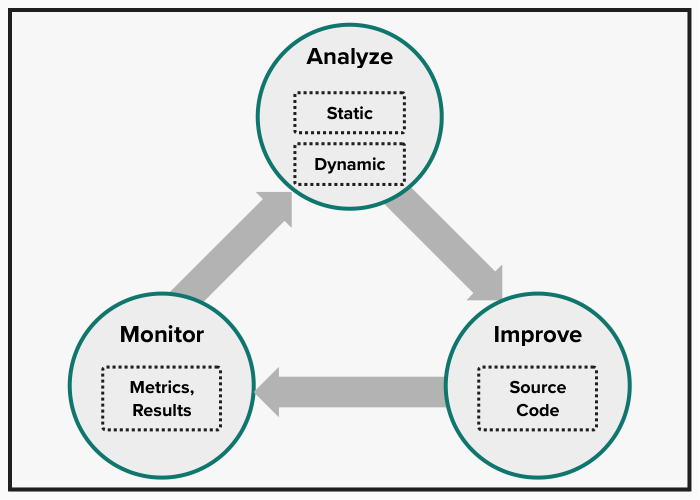

# Chapter 5: Code Analysis

This chapter provides an overview of many static and dynamic tools, technologies, and approaches, introducing both general technologies and specific tools with an emphasis on improvements they can suggest and how they can provide continuous, automated monitoring.

## Boundary Analysis

For every method-under-test there is a set of valid preconditions and arguments. It is the domain of all possible values that allows the method to work properly. That domain defines the method’s boundaries. Boundary testing requires analysis to determine the valid preconditions and the valid arguments. Once these are established, you can develop tests to verify that the method guards against invalid preconditions and arguments.

> Perform Boundary Analysis to Cover All Scenarios

Boundary analysis is about finding the limits of acceptable values, which includes looking at the following:
* All invalid values
* Maximum values
* Minimum values
* Values just on a boundary
* Values just within a boundary
* Values just outside a boundary
* Values that behave uniquely, such as zero or one

All of the .NET Framework primitive data types have important limits. Boundary values for commonly-used .NET data types are shown in Table 5-1.

#### Table 5-1. Boundaries for Some Common .NET Types

|     Type |    Maximum |      Minimum | Default |  Special |    Edge Cases |
|----------|------------|--------------|---------|----------|---------------|
|   String | (variable) | string.Empty |    null |       -- | special chars |
|    Int32 |   MaxValue |     MinValue |       0 |       -- |      -1, 0, 1 |
|  Decimal |   MaxValue |     MinValue |    Zero | MinusOne | (situational) |
|   Double | MaxValue, PositiveInfinity | MinValue, NegativeInfinity | 0d | NaN | (situational) |
| DateTime |   MaxValue |     MinValue | “zero date” | Now, Today | (situational) |
|     Guid |         -- |           -- |   Empty |       -- |            -- |

An example of a situational case for dates is a deadline or time window. You could imagine that for a bank lending to a student, a loan disbursement must occur no earlier than 30 days before or no later than 60 days after the first day of the semester. Another situational case might be a restriction on age, dollar amount, or interest rate. There are also rounding-behavior limits, like two-digits for dollar amounts and six-digits for interest rates. There are also physical limits to things like weight and height and age. Both zero and one behave uniquely in certain mathematical expressions. Time zone, language and culture, and other test conditions could be relevant. Analyzing all these limits helps to identify boundaries used in test code.

In chapter 2, we introduced [TDD Guided by ZOMBIES](https://blog.wingman-sw.com/tdd-guided-by-zombies) by James Grenning.

James uses the acronym Z.O.M.B.I.E.S. to remember boundary-value analysis:
* Z – Zero
* O – One
* M – Many (or More complex)
* B – Boundary Behaviors
* I – Interface definition
* E – Exercise Exceptional behavior
* S – Simple Scenarios, Simple Solutions

Emily Bache applies this concept in this blog post: [Slicing a task using ZOMBIES](https://sammancoaching.org/learning_hours/small_steps/zombies.html)

This acronym is intended to help you to think up initial test cases and to add to your list as you develop the software, working iteratively and incrementally.

## Systematic Evaluation

Code analysis encompasses a structured approach to enhancing software quality, leveraging both static and dynamic methodologies to scrutinize and refine code. This process is integral to continuous improvement, enabling developers to identify and rectify issues efficiently.

### The Cycle of Software Improvement

Software improvement unfolds in a cyclical three-phase process: _Analyze_, _Improve_, and _Monitor_. This model fosters a continuous loop of assessment and enhancement:



1. **Analyze**: This initial stage focuses on understanding the current state of the software by examining the code and system behavior. It involves:
   - **Static Analysis**: Evaluating the code without execution, inspecting source code, binaries, or other components for potential issues.
   - **Dynamic Analysis**: Assessing the system during runtime to capture performance metrics, memory usage, and other operational data.

2. **Improve**: Actions derived from the analysis phase are implemented here, including source code modifications, architectural adjustments, and design improvements. This phase aims to address identified shortcomings through tuning, refactoring, and remediation efforts.

3. **Monitor**: Ongoing review processes, both formal and informal, ensure continuous oversight. Monitoring involves evaluating system performance and functionality against established metrics to identify deviations requiring analysis. Effective monitoring blends manual examination with automated assessments to maintain and enhance software quality continuously.

This approach seems simple and self-evident, yet it is rarely practiced by teams and on projects. Whatever the aversions and biases that block this cycle, the software improvement out to start with a strong effort at the Analyze phase. Experience shows that putting the effort here pays huge dividends.

The system is analyzed in two primary ways: static analysis and dynamic analysis. With static analysis the system is evaluated without needing to run the program. This is done by inspecting the source code, the assemblies, or other components of the system. Dynamic analysis requires the system to run while the memory usage, performance timings, executed queries, or other profile of the system is captured. Dynamic analysis often takes place by analyzing the data after the run or by comparing two previous runs that took place at different times or under different conditions. An effective Analyze phase points out areas for investigation and improvement.

In the Improve phase source code changes suggested either directly or indirectly in the Analysis phase are made. Improvements to the architecture, design, or other aspects of the system also happen at this point. Tuning, refactoring, and remediation are all implemented within the Improve phase.

The Monitor phase may consist of informal or scheduled code reviews or system testing. Monitoring can be either objective or highly subjective, but the usual outcome is that analysis takes place. For example, if system testing reveals unacceptably slow load times then, as a result, the development team initiates performance analysis. Ideally, there ought to be established metrics and expected results with deviations from the acceptable limits triggering analysis. The best monitoring involves both manual and exploratory review coupled with frequent, structured assessment. The Monitoring phase should use components that are continuous and automated.

### Integration with Build Pipelines

The concept of Application Lifecycle Management (ALM) encapsulates key facets of software development, including requirements, design, coding, testing, deployment, maintenance, and project management. These elements recur throughout the development process, with code analysis tools and techniques playing a pivotal role at various stages.

## Static and Dynamic Analysis in .NET

Static analysis is a critical component of software quality assurance, examining code and assemblies without executing the program. This analysis helps ensure code adherence to coding standards and evaluates modules for compliance with good coding practices. When discrepancies are found, static analysis tools generate a list of violations, guiding developers to areas requiring attention.

- **Static Analysis**: Evaluates the software in a non-running state, focusing on source code and modules to assess compliance with coding standards and architectural guidelines.
- **Dynamic Analysis**: Involves analyzing the software during execution, capturing performance metrics and other runtime behaviors to identify potential issues.

## Static Analysis

> Thoroughly Analyze Modules Using Static Analysis

Static analysis looks at the code and the assemblies while they are “at rest.” Static analysis does not require the program to run. For source code, static analysis is able to determine how well the code follows a set of coding standards. For assemblies, static analysis determines how well the assemblies follow accepted rules for .NET managed code. When the code or the assemblies do not meet expectations the result is a list of violations that reference the standard or rule that is violated. These rules, guidelines, recommendations, and standards come from various sources that may include the following:
* Microsoft's .NET Design Guidelines
* C# coding standards
* Code quality formula
* System architecture and design documents

The purpose of static analysis is to answer important questions about how well the software is built. These questions may include the following:
* Is the code easy to read and maintain?
* Is the complexity of the code under control?
* Do the assemblies perform well?
* Is the code dependable and secure?
* Are best practices and system design objectives being followed?
* Does the system have the desired structure?

Static analysis takes either the source code or the assemblies as input for analysis. Based on these inputs the tool evaluates one or more of the following aspects:
* Adherence to library development guidelines
* Readability, maintainability, and coding standards
* Code quality metrics
* As-built design, structure, and dependencies

### Framework Design Guidelines

Microsoft offers the [Framework design guidelines](https://learn.microsoft.com/en-us/dotnet/standard/design-guidelines/) for *designing libraries that extend and interact with .NET*. Frameworks and assemblies intended to reach a broad number of .NET developers should follow these guidelines.

### Coding Standards
Coding standards are intended to improve readability, consistency, and maintainability. You can define and maintain consistent code style in your codebase by defining .NET code-style rules and their associated options, described here [Code-style rule options](https://learn.microsoft.com/en-us/dotnet/fundamentals/code-analysis/code-style-rule-options). As explained in the documentation:
* *These rules are surfaced by various development IDEs, such as Visual Studio, as you edit your code.*
* *For .NET projects, these rules can also be enforced at build time.*

In addition, [StyleCop Analyzers for the .NET Compiler Platform](https://github.com/DotNetAnalyzers/StyleCopAnalyzers) defines a widely-used coding standard. StyleCop is a static analysis tool that provides developers an effective way to follow the coding standard. It also gives projects a way to customize and report violations of the coding standard.

### Code Metrics and Architecture

There are many tools available to calculate code metrics for your .NET code. If you have Visual Studio Premium or Enterprise then you already have the means to calculate code metrics. The top-of-the-line Visual Studio version includes architecture and design analysis tools as well as UML modeling, layering, dependency matrix, and code metrics tools.

Static analysis tools that evaluate the system architecture and design reveal the structure, design, and dependencies of the built system. The analysis work involves matching up the system design as it is built to the intended design. The individual developer uses static analysis while coding to ensure that the development work is consistent with the design objectives. The team leader uses static analysis to review and monitor the team's development work against design objectives. Improvements come by resolving the differences and making decisions about whether to conform to the design or change the design to reflect a better choice.

[NDepend](www.ndepend.com) is a widely-used and relatively well priced architecture and design analysis tool. It has broad application in understanding and improved architecture and in enforcing design rules. 

### Improvement Through Analysis

The improvement phase of code analysis involves making code and architectural enhancements suggested by the analysis phase. This includes tuning, refactoring, and addressing design or dependency issues.

### Monitoring Software Quality

> Fail the Build for Violations of Required Rules

Monitoring, an ongoing phase, involves reviewing code and system performance to ensure continued adherence to project objectives. This can include both formal reviews and automated testing, leveraging continuous integration (CI) processes to maintain software quality.

#### Integration with Application Lifecycle Management (ALM)

Static and dynamic analysis tools play a significant role across the ALM stages, supporting developers and team leaders in ensuring that development efforts align with design objectives and project standards.

## Static Analysis Tools

Most developers want to run code analysis from the command line interface. They also want to incorporate code analysis as a step in the Continuous Integration process.

The good news is that .NET analyzers run during the *build* command. These analyzers are part of the .NET diagnostics family of tools for the framework. Code quality analysis ("CAxxxx") rules inspect your C# code for security, performance, design and other issues. Analysis is enabled, by default, for projects that target .NET 5 or later. For more information, see [Overview of .NET source code analysis](https://learn.microsoft.com/en-us/dotnet/fundamentals/code-analysis/overview).

It's important to know that, by default, not all the rules are enabled. To enable all rules, you might want to set:
```xml
<AnalysisMode>AllEnabledByDefault</AnalysisMode>
```

This `AllEnabledByDefault` setting is set in your `.csproj` or the `Directory.Build.props` file, which is placed in the project directory or a directory above that project directory. For more information, see [Customize the build by folder](https://learn.microsoft.com/en-us/visualstudio/msbuild/customize-by-directory).

Many rules are reported as warnings, to not break the build. However, during the build process you may want to treat warnings as errors. The earlier in 

#### Third-party analyzers
In addition to the official .NET analyzers, you can also install third party analyzers, such as [StyleCop](https://www.nuget.org/packages/StyleCop.Analyzers/), [Roslynator](https://www.nuget.org/packages/Roslynator.Analyzers/), [XUnit Analyzers](https://www.nuget.org/packages/xunit.analyzers/), and [Sonar Analyzer](https://www.nuget.org/packages/SonarAnalyzer.CSharp/).

#### Run code analysis as a GitHub Action
The [dotnet/code-analysis](https://github.com/dotnet/code-analysis) GitHub Action lets you run .NET code analyzers as part of continuous integration (CI) in an offline mode. For more information, see [.NET code analysis GitHub Action](https://learn.microsoft.com/en-us/dotnet/devops/dotnet-github-action-reference#net-code-analysis).

### Duplicate Code Finders

> Find and Address Any Inappropriate Duplication of Code

Code analysis is able to find code duplication. A tool like [Simian](https://simian.quandarypeak.com/) performs "similarity analysis" to help discover code duplication and reduce the amount of duplicate code.

#### Identifying and Addressing Duplicate Code

Duplicate code can significantly hinder maintainability and readability. Tools designed to identify such redundancies help in distinguishing between the benign and the problematic duplications, guiding developers towards meaningful refactoring opportunities. Effective use of these tools requires a judicious approach to avoid inappropriate generalization that could lead to a diluted domain model and increased complexity.

### Manual Code Reviews: Beyond Automation

While automated tools provide significant insights, the value of manual code reviews cannot be overstated. These reviews bring human judgment, experience, and a deeper understanding of design intentions to the forefront, facilitating knowledge transfer and fostering a culture of continuous improvement.

### Architectural and Design Analysis

Software architecture and design form the blueprint of any system. Static analysis tools that focus on architectural integrity help reveal deviations from planned designs, enabling teams to make informed decisions about aligning the actual software structure with its intended design or adapting the design to reflect better choices discovered during development.

### Utilizing Code Metrics for Informed Decision Making

Code metrics offer quantitative insights into various aspects of the code base, such as complexity and adherence to best practices. Tools integrated into development environments like Visual Studio enable teams to monitor these metrics continuously, aiding in the identification of areas requiring attention.

### Quality Assurance Metrics: A Holistic View

Quality Assurance (QA) metrics provide a holistic view of software quality, linking defects to specific modules, requirements, or aspects of the system. Analyzing these metrics helps pinpoint error-prone areas, guiding targeted improvements and contributing to the overall robustness of the software.


### Implementing Manual Code Reviews and Metrics Analysis

Manual code reviews in Python benefit from the same principles as in other languages, focusing on design adherence, coding standards, and best practices. Tools like `radon` can provide code metrics, while `bandit` offers insights into security vulnerabilities, complementing the manual review process.

### Static Analysis: Summary

Code analysis, encompassing automated tools and manual reviews, forms a critical component of the software development lifecycle. By continuously monitoring code quality, architectural alignment, and system behavior, development teams can ensure that their software not only meets the current requirements but is also poised for future enhancements. The principles of effective code analysis guide the goal of delivering high-quality, maintainable, and robust software solutions.


## Dynamic Analysis

Dynamic analysis plays a crucial role in understanding software behavior by executing the program under various conditions to gather runtime information. This approach complements static analysis by providing insights into performance, memory usage, test coverage, and internal state during execution, answering critical questions about the software's operational characteristics.

Dynamic analysis involves running the program and carrying out usage scenarios, automated tests, and creating other interesting conditions. The purpose is to collect information about performance, memory usage, test coverage, or internal program state while the application is running. For example, code coverage could focus on your interest in understanding how much of the code-under-test is visited while all the tests are running. Some of the many questions that dynamic analysis attempts to answer could include:
* What statements does the program spend the most time executing?
* What is the memory usage and what are the opportunities for optimizations?
* What code are my unit tests not testing?
* What is the application state just before an exception is thrown?
* What are the queries the system is sending to the database?

Dynamic analysis gives insight into what the system is doing as it runs and interacts with other systems, such as the database. Dynamic analysis is also tied into the [Microsoft Security Development Lifecycle](https://www.microsoft.com/en-us/securityengineering/sdl) process tools. These are testing tools designed to help detect flaws that may expose security vulnerabilities.

Just beyond the scope of this section, these verification tools use approaches like input fuzzing, validation, and attack surface analysis to uncover potential problems. Here is a partial list of tools:
* Code Security plugins for Visual Studio and more
* Microsoft Threat Modeling Tool to create and analyze threat models
* Roslyn Analyzers to analyze code at build time
* Microsoft DevSkim to provide inline security analysis
* CodeQL semantic code analysis engine
* Attack Surface Analyzer tool
* Credential Scanner (CredScan) to identify credential leaks
* BinSkim verification tool that analyzes binaries
* Secure DevOps Kit for Azure for dev ops teams


### Objectives of Dynamic Analysis

Dynamic analysis aims to uncover details about the software that can only be observed during its execution, such as:
* Hot-spots and performance bottlenecks
* Memory consumption patterns and optimization opportunities
* Areas of code not exercised by unit tests
* Application state prior to exceptions or failures
* Database interactions and efficiencies

### Tools and Practices

> Run Tests under Code Coverage

#### Code Coverage
Code coverage tools measure how completely a program runs as it is running. In common practice, automated tests are what exercise the program so that the code coverage tool can perform its measurements.

In Chapter 3 the subject of automated testing is presented from the perspective of writing effective tests. The tests are written to check the intention of the code. However, the question remains: *what code is not covered by tests?* This question is broadly answered with a test coverage number, which indicates the percentage of code that is tested when the tests are run. The principle is that a test coverage tool runs the test suite and monitors the code-under-test. The test coverage tool tracks each symbol within the code-under-test and tracks these symbols as they are executed while the code is running. A symbol can be thought of as any point in the code that is a valid breakpoint for the debugger. The percentage of symbols covered is analyzed and calculated. Various code coverage measures are listed in Table 5-9.

#### Table 5-9. Measures of Code Coverage
|  Coverage | Description |
|-----------|-------------|
|     Class | If the program-running-under-analysis (program) executes code within a class, then the coverage tool counts that class as visited. The coverage tool totals each visited class and computes a percentage of all the classes in the code that were visited during the run. |
|    Method | Every time the program executes a method, the coverage tool counts that visit. The coverage tool computes a percentage of the methods that were visited during the run. |
|      File | This is the percentage of source files with code that contains code executed during the run. |
| Statement | If the program executes a statement, then the visit is counted. A percentage is calculated representing the percentage of statements visited during the run. |
|    Symbol | Every time the program executes a symbol in the code, the coverage tool counts that visit toward the percentage of the total symbols executed.
|    Branch | A branch is any logic-branch in the code; for example, one if statement represents the branching logic for a code block. Every time the test code executes code within a branch, it counts that visit toward the percentage of total branches executed. |

Code coverage tools are used as part of the coding, design, testing, and maintenance aspects of ALM. These tools provide the individual developer valuable feedback when writing automated tests. With code coverage, the developer finds the uncovered branches, exception scenarios, and corner-cases. The team leader uses these tools to gauge progress against code coverage objectives. When correctness is important to a critical module, the team leader can monitor and insist that code coverage reach as close to 100% as is practicable. Similarly, improving code coverage is a measurable maintenance goal to target as part of a reduction in technical debt.


#### Incorporating Dynamic Analysis into Development

Incorporating dynamic analysis into the development process requires regular and systematic execution of tests under varied conditions, monitoring performance, and analyzing runtime behavior. It's a proactive measure to ensure software performance and reliability meet the expectations without waiting for issues to manifest in production environments.

#### Dynamic Analysis: Summary

Dynamic analysis is a key aspect of a comprehensive software testing strategy, providing critical insights into the runtime behavior of applications. By integrating dynamic analysis tools and practices, developers can proactively identify and address potential issues, ensuring that the software delivers optimal performance and reliability.

In the .NET development landscape, leveraging tools like `example1`, `example1`, and the `logging` module, among others, facilitates a robust approach to dynamic analysis, complementing static analysis efforts and contributing to the overall quality of the software development lifecycle.


### Chapter Summary

This chapter presented a structured framework for advancing software quality. It is the _Analyze_, _Improve_, and _Monitor_ cycle. This conceptual model lays the groundwork for continuous improvement within software development processes. We delved into two principal facets of code analysis, static analysis and dynamic analysis, each offering unique insights into software construction and behavior.

#### Static Analysis: A Closer Look at Code Quality

Static analysis serves as a foundational step in the software improvement cycle, offering a lens through which the construction quality of software is evaluated without the need to execute the program. This approach scrutinizes source code and assemblies to ensure adherence to coding standards and best practices, aiding in the identification of potential issues that could compromise software quality.

#### Dynamic Analysis: Understanding Runtime Behavior

Dynamic analysis complements static analysis by examining the software in action. Through techniques such as sampling and instrumentation, dynamic analysis captures valuable data about the software's performance, memory usage, and overall behavior during execution. This process is instrumental in uncovering areas of the code that may not be adequately tested and identifying opportunities for optimization.

#### Integration with Application Lifecycle Management (ALM)

Code analysis is integral to Application Lifecycle Management (ALM), encompassing security analysis, adherence to recommended patterns, and best practices. The application of rigorous code analysis techniques is essential for active analysis, targeted improvements, and ongoing monitoring, ensuring that software development aligns with both technical and business objectives.

#### Conclusion

This chapter highlighted the significance of a methodical approach to code analysis within the broader context of software development. By embracing the Analyze, Improve, and Monitor cycle, developers can ensure their software not only meets current standards but is also positioned for future enhancements and growth. Incorporating these tools underscores the versatility and universal applicability of these concepts, demonstrating their value in fostering software excellence across diverse development ecosystems.


